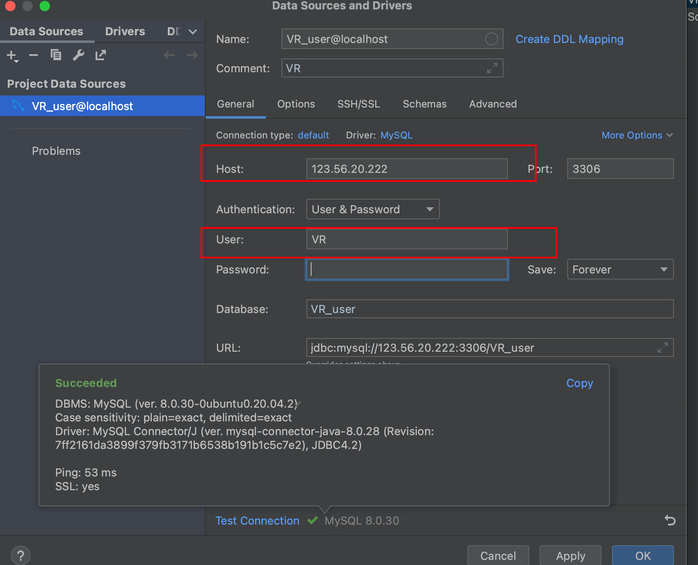
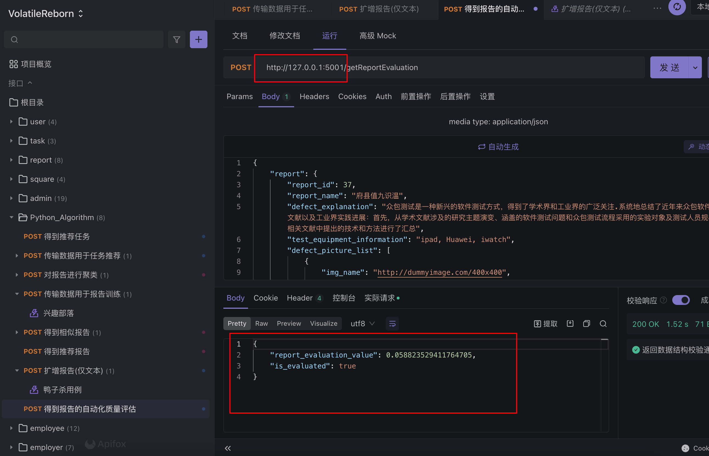

# Mysql Config

* 项目使用mysql数据库, 运行在lyk的server:

  * host: 123.56.20.222

* 用户密码以及权限我已经配置好了:

  * username: VR
  * password: VR
  * 权限: 拥有全部权限

* 目前数据库里什么都没有, 需要后端根据需求自己建数据库和表. 当然, 我之前的项目已经提供了现成的建表语句, 只需要跑一下就行了:

  

* 注意, 这次我们的项目是“volatile_reborn”, 因此数据库全都用“VR”作为开头名, 比如, 用户数据库名字应该叫叫"VR_user", 而不是"volatile_user", 你们需要自己修改建表语句. 写的时候要小心.

* 可以使用专用工具Datagrip来操作数据库

* 我已经测试了数据库连接, 是OK的:

  

# Frontend

* 已经完成CICD和容器集群配置, 仅存的问题是: Jenkins服务器太垃圾了, 每次cicd都会在npm build那里卡上两小时. 由于jenkins和前端项目都部署在jenkins的宿主机, 所以宿主机卡死会导致jenkins和前端都不能访问....
  * 所以千万不要随意push到master, 可以push到别的分支. 等到发布的那个版本再push到master

# Backend

* 后端CICD比较快, 大概5min内就能出结果.
* 我添加了一个shell脚本`testLocally.sh`来进行简单的本地部署测试, 它的工作流是Jenkins的简化版,  会build jar包,build镜像然后在本地运行容器. 可以本地运行该脚本来进行测试
  * 由于Zull和collect-service都将自身注册到Eureka, 因此无论是本地启动jar包, 还是本地启动容器, 都应该先启动Eureka,再启动其余服务

## collect-service

* collect-service监听**9000**端口, 映射到主机的**9000**端口

* collect-service监听了eureka的8001端口. 注意, eureka目前和collect-service部署在同一台主机, 因此使用`localhost`

  ```yaml
  # collec-service的配置文件
  server:
    port: 8000
  
  #mybatis:
  #  mapper-locations: classpath*:com
  
  eureka:
    client:
      service-url:
        defaultZone: http://localhost:8001/eureka/
    instance:
      prefer-ip-address: true
  ```


### Test

#### Locally

本地调试请千万不要使用容器, 而是直接启动jar, 原因是使用容器启动时, 本地似乎总是绑定了8000端口(尽管我指定的`server.port=9000`), 而同样的项目我用idea启动确显示绑定到了9000. 并且, 以容器形式运行时, 尽管显示绑定到了8000, 可依然无法访问8000. 我debug了一天, 也不知道为什么.


#### Online

可以在公网上测试, 注意使用正确的url


## Eureka

* Eureka监听**8001**端口, 映射到主机的**8001**端口

  ```
  # eureka的配置文件
  eureka.client.service-url.defaultZone=http://localhost:8001/eureka
  eureka.client.register-with-eureka=false
  eureka.client.fetch-registry=false
  server.port=8001
  ```

  

### Test

如果其他服务也**正常**启动并成功注册到Eureka, 那么可以在Eureka的网页上看到被注册的服务

#### Online

访问:http://124.222.135.47:8001/


#### Locally

访问localhost8001


## Zuul

* Zuul监听**9999**端口, 映射到主机的**9999**端口(事实上我使用了Docker的host网络, 并没有进行任何端口映射, 直接就是9999)

  ```yaml
  # Zull的配置文件
  server:
    port: 9999
  
  spring:
    application:
      name: collect-gateway
  
  eureka:
    client:
      service-url:
        defaultZone: http://localhost:8001/eureka/
    instance:
      prefer-ip-address: true
  
  zuul:
    routes:
      collect-service: /**
  
  hystrix:
    command:
      default:
        execution:
          isolation:
            thread:
              timeoutInMilliseconds: 6000 # 熔断超时时长：6000ms
  
  ribbon:
    ConnectTimeout: 500 # ribbon链接超时时长
    ReadTimeout: 2000 # ribbon读取超时时长
    MaxAutoRetries: 0  # 当前服务重试次数
    MaxAutoRetriesNextServer: 1 # 切换服务重试次数
    OkToRetryOnAllOperations: false # 是否对所有的请求方式都重试，只对get请求重试
  ```


### Test

### Online

### Locally

# Algorithm Server

算法没有部署集群, 是单主机的

## Test

可以本地启动项目， 使用Apifox查看网络请求:



算法服务部署后, 可以使用Apifox在公网(`124.222.135.47:5001`)查看网络请求:


# Accounts

下面给出一些账号, 方面大家测试:

* 管理员:
  * phone_number: 12345678900
  * password: 123
* 工人1:
  * phone_number: 12345678800
  * password: 123
* 工人2:
  * phone_number: 12345678432
  * password: 123
* 发包方:
  * phone_number: 12345678801
  * password: 123


